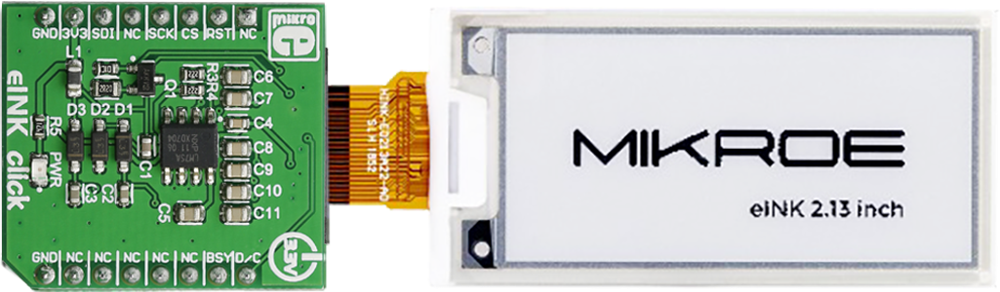

# eInk Click convert tool for creating bitmaps
Tool for creating bitmap .spin2 files for use with P2 driver for Mikroe eInk Click

![Project Maintenance][maintenance-shield]

[![License][license-shield]](LICENSE)


## Create bitmaps for use on eInk display

When using our eInk display we want to place images on it. 
<p align="center">
  
</p>

## Utility *create*

This tool is used to convert bitmaps created at the free website [Piskel](https://www.piskelapp.com/p/create/sprite) into souce code we can compile into our P2 project.

## Current status

Latest Changes:

```
10 June 2022 
- adding missing parts (command-line options) to convert
09 June 2022 
- 'convert' tool is working (can still be refined)
```


## Table of Contents

On this Page:

- [Test your ability to make the convert utility](#test-your-ability-to-make-the-convert-utility)
- [Create your image at website](#create-your-image-at-website)
- [Download your image as .c file](#download-your-image-as-c-file)
- [Build your image into convert](#build-your-image-into-convert)
- [Generate your image .spin2 file](#generate-your-image-spin2-file)
- [Include your .spin file and pace your image on screen](#include-your-spin-file-and-pace-your-image-on-screen)

Additional pages:

- [Top README](https://github.com/ironsheep/P2-Click-eInk) - Return to the top-level README for this repository

## Test your ability to make the convert utility

In the folder containing convert.c you'll fine a script named `tst`.  Run this script:

```bash
$ tst<ret>  # run the tst script which builds a test .spin2 file
```

The output from the tst run should look like:

```bash
$ ./tst
rm -f *.o *~ core convert *.spin2
gcc -I.   -c -o convert.o convert.c
gcc -I.   -c -o argparse.o argparse.c
gcc -o convert convert.o argparse.o -I.
+ ./convert -o isp_demo_coffee_image.spin2 -i coffee -v
Verbose: ON
Writing to: isp_demo_coffee_image.spin2
Image is named: coffee

Image is 32 X 49 px
TST: Created isp_demo_coffee_image.spin2!
```

If all of this is present then you can see how to run the script:

```bash
$ ./convert -o isp_demo_coffee_image.spin2 -i coffee -v
```

The full convert command-line options are:

```bash
$ ./convert -h
Usage: convert [options] -o {outfilename}

A brief description of what the program does and how it works.

    -h, --help                show this help message and exit

convert options
    -n, --nodo                emit messages only don't do work
    -d, --debug               emit debug messages
    -v, --verbose             emit verbose messages
    -o, --outfile=<str>       filename of output file
    -i, --imagename=<str>     label of image in memory (def: 'img')

Additional description of the program after the description of the arguments.
```

*NOTE: nodo is not yet supported!*

Ok, if all of this happened you are ready to move on to the next step of creating your new image(s).  We'll use a free website to create yuor image.

## Create your image at website

Visit the [Piskel online editor](https://www.piskelapp.com/p/create/sprite) and create your own image.

NOTE: use only the colors supported by our eInk displays:

| Color Name | Hex Value |
| --- | --- |
| Black | #000000 |
| White | #FFFFFF
| Light grey | #555555
| Dark grey | #AAAAAA

## Download your image as .c file

At the Piskel website after editing your image then you want to save two files. 

- The .piskel file source so you can reload your image into the brower and refine it.
- The .c source file - this you'll build into the convert tool and then generate your .spin2 image source file

## Build your image into convert

Copy your new .c file into your convert working directory.
Edit convert.c doing the following:

| Edits needed |
| --- |
| (1) Change the included .c file to your new .c filename. That is, look near line(6) `#include "New Piskel-coffee-002.c"` and change **New Piskel-coffee-002.c** to the name of your new .c file.
| (2) Look near line(77) `int imgFrameHeight = NEW_PISKEL_FRAME_HEIGHT;` and change **NEW\_PISKEL\_FRAME_HEIGHT** to the name in your new .c file.
| (3) Look near line(78) `int imgFrameWidth = NEW_PISKEL_FRAME_WIDTH;` and change **NEW\_PISKEL\_FRAME_WIDTH** to the name in your new .c file.
| (4) Look near line(79) `const u_int32_t *imgDataArray = &new_piskel_data[0][0];` and change **new\_piskel_data** to the name in your new .c file.

Once these edits are complete then make the new utility using:

```bash
$ make clean all   # remove prior files and compile the utility
```

Your make output should look something like this:

```bash
$ make clean all 
rm -f *.o *~ core convert *.spin2
gcc -I.   -c -o convert.o convert.c
gcc -I.   -c -o argparse.o argparse.c
gcc -o convert convert.o argparse.o -I.
```

If you instead see any errors then fix them before proceeding.

## Generate your image .spin2 file

Next you'll run the new utilty to generate the .spin2 file you will need to include in your project to the image can be loaded to your eInk display.

You will want to specify at least two options (-i -and -o) of the following:

| convert Option | Example | Description
| --- | --- | --- |
| -o {filename} | -o myImage.spin2 | Specify the filename to be written
| -i {imageBaseName} | -i myImage | Specify the label name of your new image bits
| -v | -verbose  | Enable verbose messaging output
| -d | -debug | for extra fun turn this on to see the hex values the convert utilty generated as the command output

The command line for running with the above options would look like:

```bash
$ ./convert -v -o myImage.spin2 -i myImage
```

This will generate a `myImage.spin2` file with image labels within the file similar to:

```
DAT { Overlay Bitmap Data }

'  Image by Convert v1.0

	myImageWidth	WORD	16
	myImageHeight	WORD	49
	myImageBits
		BYTE	$77, $77, $77, $77, $77, $77, $77, $77, $77, $77, $07, $77, $77, $77, $77, $77	' row 1 of 49
...
...
...
		BYTE	$77, $77, $77, $77, $77, $77, $77, $77, $77, $77, $77, $77, $77, $77, $77, $77	' row 49 of 49
' Converted 32 x 49 (1568) pixel values into 784 bytes
	myImageBitsEnd
	myImageLenBytes	WORD	myImageBitsEnd - myImageBits	' Image length in bytes


```

## Include your .spin file and place your image on screen

Now that you have your .spin2 file you can include it into your project.
 
```spin2
OBJ
     eInkDisplay : "isp_eInk_click"
     coffeeImage : "isp_image_coffee"	' include my bitmap data
```

Lastly you'll send this image to be put on the display with something
 like:
 
```spin2
    pImageBits, imgWidth, imgHeight := imageInfo(coffeeImage.IMAGE_Coffee)
    eInkDisplay.placeImageAtXY(10, 10, pImageBits, imgWidth, imgHeight, 90)
```

Yes, I added a method at the top of my image file: `PUB imageInfo(eImage) : imageAddr, imageWidthBytes, imageHeightBytes` 

*This is included in the demo file of this driver. feel free to copy it to your new image file.*
(**NOTE**: widthInPix = imageWidthBytes * 2, while heightInPix = imageHeightBytes)

Ok. that's all there is to know. Have fun using your new images on your eInk displays!

-Stephen

---

> If you like my work and/or this has helped you in some way then feel free to help me out for a couple of :coffee:'s or :pizza: slices!
>
> [](https://www.buymeacoffee.com/ironsheep) &nbsp;&nbsp; -OR- &nbsp;&nbsp; [](https://www.patreon.com/IronSheep?fan_landing=true)[Patreon.com/IronSheep](https://www.patreon.com/IronSheep?fan_landing=true)

---

## Disclaimer and Legal

> *Parallax, Propeller Spin, and the Parallax and Propeller Hat logos* are trademarks of Parallax Inc., dba Parallax Semiconductor
>
> This project is a community project not for commercial use.
>
> This project is in no way affiliated with, authorized, maintained, sponsored or endorsed by *Parallax Inc., dba Parallax Semiconductor* or any of its affiliates or subsidiaries.

---

## License

Copyright © 2022 Iron Sheep Productions, LLC. All rights reserved.

Licensed under the MIT License.

Follow these links for more information:

### [Copyright](../copyright) | [License](../LICENSE)

[maintenance-shield]: https://img.shields.io/badge/maintainer-stephen%40ironsheep%2ebiz-blue.svg?style=for-the-badge

[license-shield]: https://camo.githubusercontent.com/bc04f96d911ea5f6e3b00e44fc0731ea74c8e1e9/68747470733a2f2f696d672e736869656c64732e696f2f6769746875622f6c6963656e73652f69616e74726963682f746578742d646976696465722d726f772e7376673f7374796c653d666f722d7468652d6261646765
