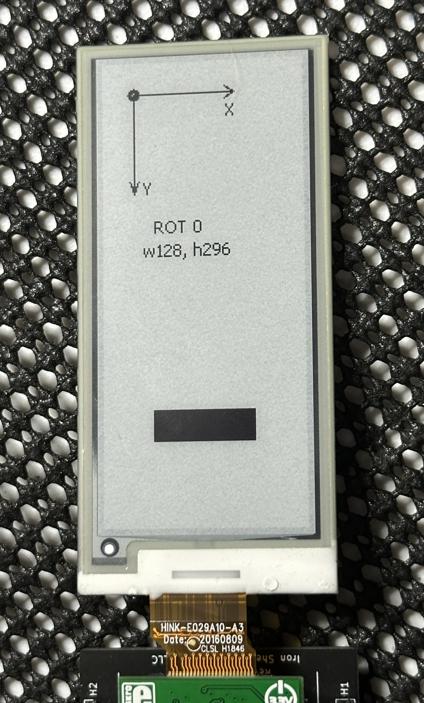
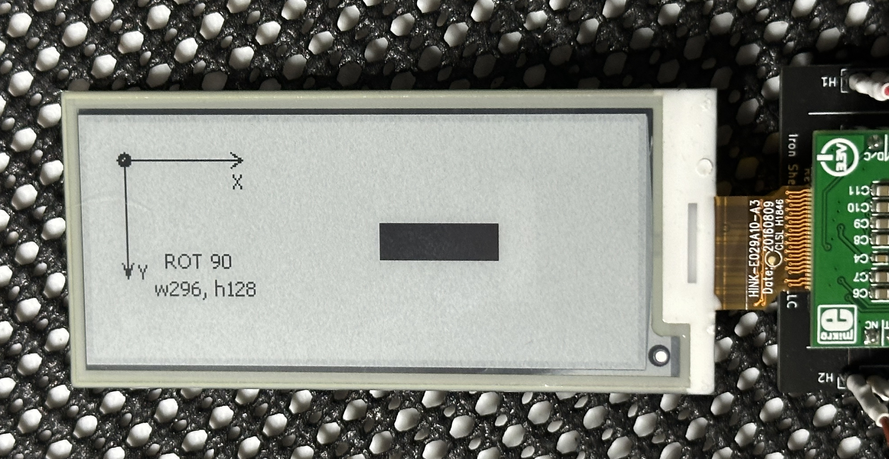
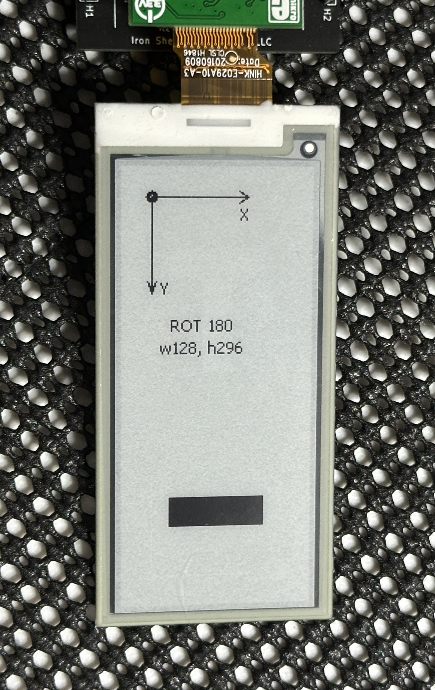
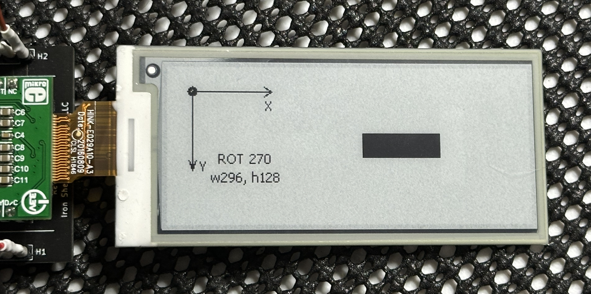

# P2 eINK Driver Orientation Setting
Details for setting the orientation of the display for your project within the driver.

![Project Maintenance][maintenance-shield]

[![License][license-shield]](LICENSE)

## Device orientation in your project

The eINK driver now supports device orientation. This means that once you decide how the eINK display is fixed to your hardware you can tell the driver the orientation of the your device and and no matter which orientation you have chosen the origin for drawing will remain in the top left corner.

**NOTE**: *the code for displaying these screens in found in the demo source file.*

To demonstrate here are pictures of the possible orientations:

### Enum value: ROTATE_0 -or- PORTRAIT

   
    <caption><B>Connector is BELOW the display!</B></caption> 

### Enum value: ROTATE_90 -or- LANDSCAPE

   
    <caption><B>Connector is to the RIGHT of the display!</B></caption> 

### Enum value: ROTATE_180 -or- PORTRAIT\_FLIP

   
    <caption><B>Connector is ABOVE the display!</B></caption> 

### Enum value: ROTATE_270 -or- LANDSCAPE\_FLIP

   
    <caption><B>Connector is to the LEFT of the display!</B></caption> 

Additional pages:

- [See images of all supported displays working!](./README.md) 
- [Top README](https://github.com/ironsheep/P2-Click-eINK) - Return to the top-level README for this repository

---

> If you like my work and/or this has helped you in some way then feel free to help me out for a couple of :coffee:'s or :pizza: slices!
>
>  &nbsp;&nbsp; -OR- &nbsp;&nbsp; [Patreon.com/IronSheep](https://www.patreon.com/IronSheep?fan_landing=true)

---

## Disclaimer and Legal

> *Parallax, Propeller Spin, and the Parallax and Propeller Hat logos* are trademarks of Parallax Inc., dba Parallax Semiconductor
>
> This project is a community project not for commercial use.
>
> This project is in no way affiliated with, authorized, maintained, sponsored or endorsed by *Parallax Inc., dba Parallax Semiconductor* or any of its affiliates or subsidiaries.

---

## License

Licensed under the MIT License.

Follow these links for more information:

### [Copyright](../copyright) | [License](../LICENSE)

[maintenance-shield]: https://img.shields.io/badge/maintainer-stephen%40ironsheep%2ebiz-blue.svg?style=for-the-badge

[license-shield]: https://img.shields.io/badge/License-MIT-yellow.svg
