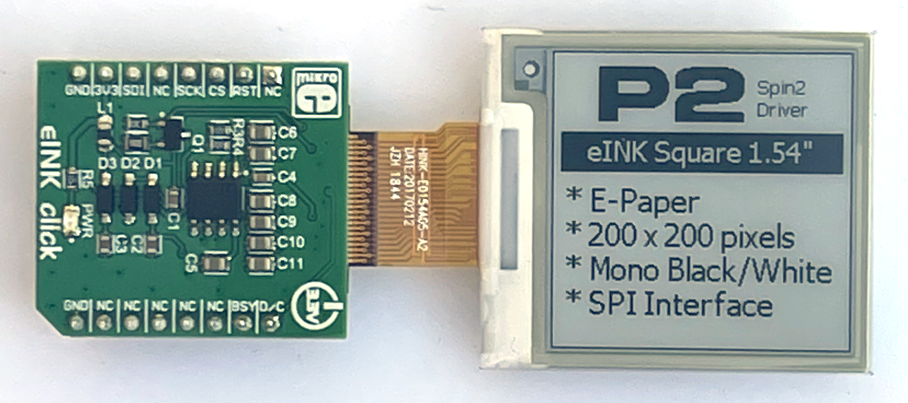
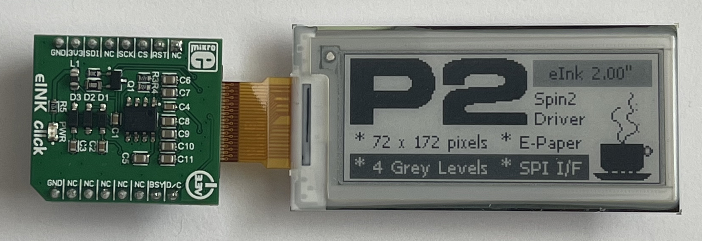
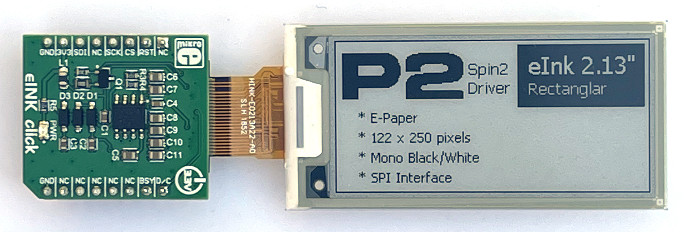
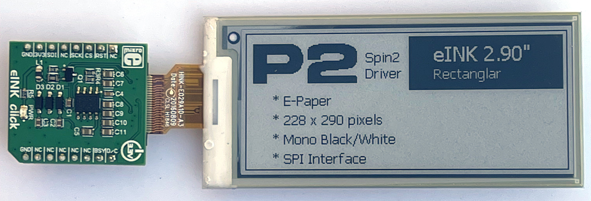

# P2 eINK Hardware Documents
Hardware documents for the Mikroe eINK adapter Click board™

![Project Maintenance][maintenance-shield]

[![License][license-shield]](LICENSE)

## The hardware

These documents serve as additional reference for the eINK display as shipped from Parallax.com and Mikroe.com. 

**1.54" eINK hardware** - 200x200 pixels - (avail from [Parallax.com](https://www.parallax.com/product/200-x-200-1-54-inch-e-paper-display-for-eink-click/))

  

**2.00" eINK hardware** (avail from [Mouser.com](https://www.mouser.com/ProductDetail/Display-Visions/EA-EPA20-A?qs=EU6FO9ffTwdcD%252BcseurWVQ%3D%3D))

  

**NOTE***: this display has two levels of gray in addition to black and white.*

**2.13" eINK hardware** - 122x250 pixels- (avail as bundle from [Parallax.com](https://www.parallax.com/product/eink-click-e-paper-bundle-2/) or as display only also from [Parallax.com](https://www.parallax.com/product/122-x-250-2-13-inch-e-paper-display-for-eink-click/))

  

**2.90" eINK hardware** - 128x296 pixels- (avail from [Parallax.com](https://www.parallax.com/product/296-x-128-2-9-inch-e-paper-display-for-eink-click/))

  

## Hardware Documents

The following documents are found in this repo (this driver is inteded to support all of these displays):

| Filename | Purpose | Description | eINK Display
| --- | --- | --- | --- |
| [epa20-ae.pdf](epa20-ae.pdf) | eINK display | Older display data sheet | 2.00"
| [LM75A.pdf](LM75A.pdf) | controller chip | **Product data sheet** - Digital temperature sensor and thermal watchdog, Rev 04 - 10 July 2007 | 1.54", 2.00", 2.13", and 2.9"
| [ssd1606.pdf](ssd1606.pdf) | controller chip | **Solomon Systech SSD1606** 4GS Active Matrix EPD 128 x 180 Display Driver with Controller - Oct 2011 | 2.00"
| [ssd1608.pdf](ssd1608.pdf) | controller chip | **Solomon Systech SSD1608** Active Matrix EPD 240 x 320 Display Driver with Controller - Jan 2015 | 1.54"
| [ssd1675.pdf](ssd1675.pdf) | controller chip | **Solomon Systech SSD1675** 160 Source x 296 Gate Active Matrix EPD Display Driver with Controller - Aug 2016 | 2.13" and 2.9"

Additional pages:

- [Top README](https://github.com/ironsheep/P2-Click-eINK) - Return to the top-level README for this repository

---

> If you like my work and/or this has helped you in some way then feel free to help me out for a couple of :coffee:'s or :pizza: slices!
>
>  &nbsp;&nbsp; -OR- &nbsp;&nbsp; [Patreon.com/IronSheep](https://www.patreon.com/IronSheep?fan_landing=true)

---

## Disclaimer and Legal

> *Parallax, Propeller Spin, and the Parallax and Propeller Hat logos* are trademarks of Parallax Inc., dba Parallax Semiconductor
>
> This project is a community project not for commercial use.
>
> This project is in no way affiliated with, authorized, maintained, sponsored or endorsed by *Parallax Inc., dba Parallax Semiconductor* or any of its affiliates or subsidiaries.

---

## License

Copyright © 2022 Iron Sheep Productions, LLC. All rights reserved.

Licensed under the MIT License.

Follow these links for more information:

### [Copyright](../copyright) | [License](../LICENSE)

[maintenance-shield]: https://img.shields.io/badge/maintainer-stephen%40ironsheep%2ebiz-blue.svg?style=for-the-badge

[license-shield]: https://img.shields.io/badge/License-MIT-yellow.svg
