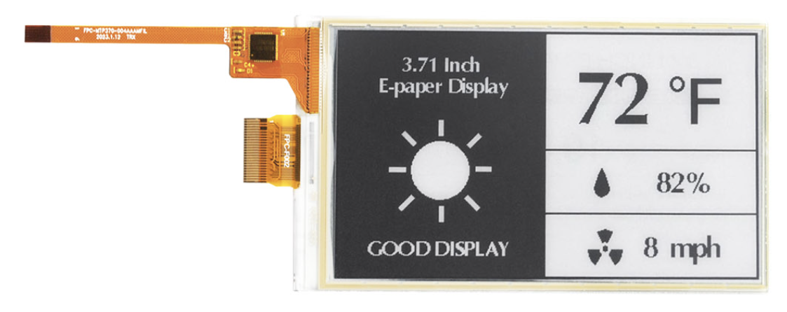
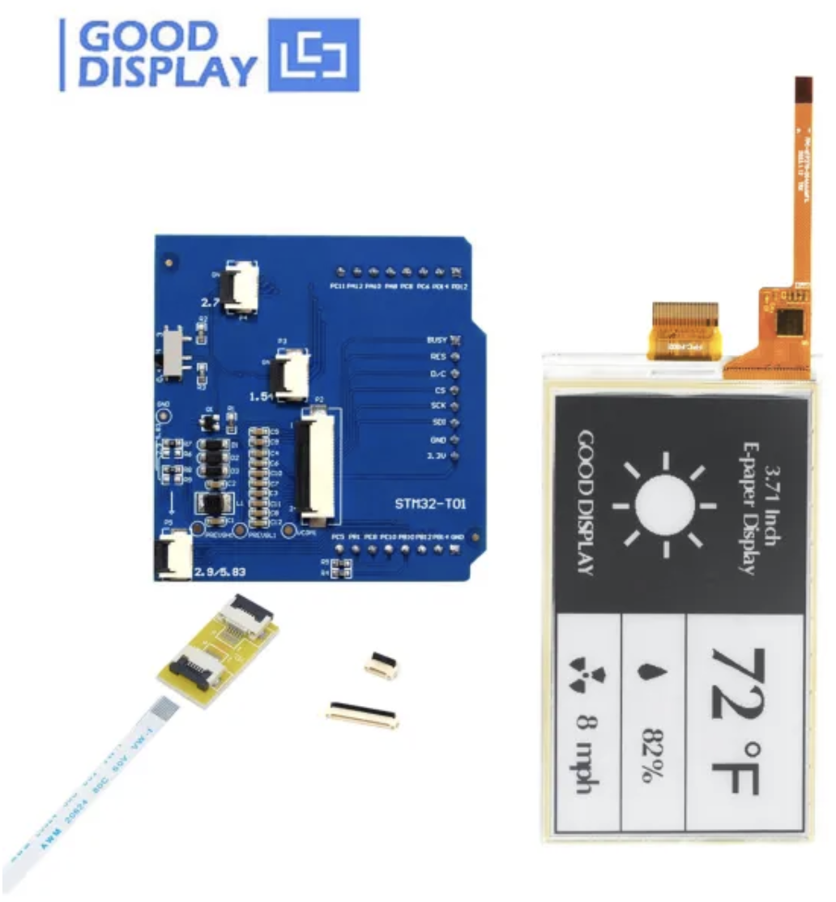
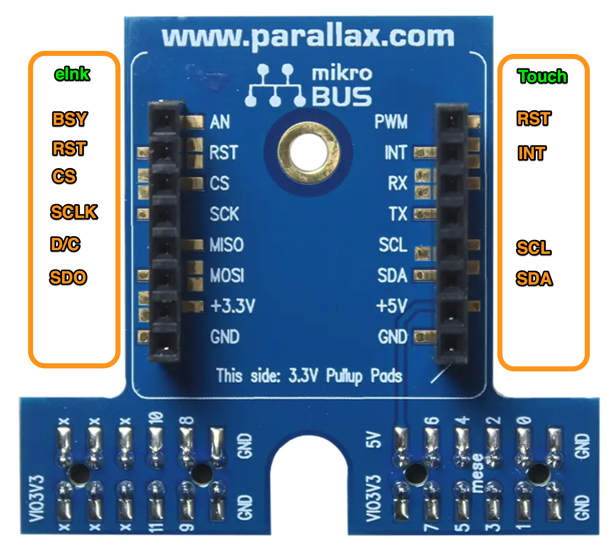

# P2 driver for Click adapter driving the Good Display eInk 3.70" e-paper w/Touch  

![Project Maintenance][maintenance-shield]

[![License][license-shield]](LICENSE)

## eInk 3.70" display (240x416 pixels) w/Touch

If you wish to use the eInk Touch display with your P2 Evaluation board, P2 Edge Module Breadboard, or the P2 Edge Mini Breakout Board then you'll need:

the Eval adapter board [P2 Eval to MikroBUS Click Adapter](https://www.parallax.com/product/p2-to-mikrobus-click-adapter/)

Additionally, you can buy the eInk displays from [Good Display](https://www.good-display.com/):

- [E-Ink Touch Screen for 3.7 inch High Transparency E-Paper Display GDEY037T03-T02](https://www.good-display.com/product/474.html) - display with touch overlay

   
  <caption><B>Display w/Touch only</B></caption>

- or you can select the following at checkout:  **SKU "GDEY037T03-T02 with STM32 adapter board"** - adds adapter HAT board

   
  <caption><B>Display w/Touch, cables, and HAT board</B></caption>

## Table of Contents

On this Page:

- [The eInk Display](#features)
- [Wiring the Display](#how-to-contribute)

Additional pages:

- [Driver Public Interface](./isp_eInk_click.txt) - shows full driver annotated API 
- [Start your project using this object](DEVELOP.md) - Walks thru configuration and setup of your own project using this object
- [Configure Display Orientation](../Docs/Orientation.md) - set driver to match your hardare set up
- [Create bitmaps for display on your eInk device](./C-src)
- [See images of all supported displays working!](./Docs) There are a small number of .PDFs in the [Docs](../Docs) directory providing  detailed information on the display and controller chips

## Connecting the eInk display w/Touch to the P2

When using the GDEY037T03-T02 eInk display from Good Displays you do NOT use the **Mikroe eInk adapter Click board™**, instead, you wire the HAT adapter directly to the P2 Eval Click Adapter. This is due to the support electronics being different from that on the eInk Click board.  This also allows us to route the touch signals to the same adapter board so the entire display with touch consumes just the P2 Eval. Header pair.

Here's the signal mapping:

   
  <caption><B>Mapping the eInk signals and the Touch signals to the Click Adapter</B></caption>

Here's the full mapping table:

| Signal Name | HAT Pin | Adapter Pin 
| --- | --- | --- 
| | **eInk Signals** | 
| BUSY | P6 BUSY | AN 
| RST | P6 RES | RST 
| CS | P6 CS | CS 
| SCK | P6 SCLK | SCK 
| D/C | P6 D/C | MISO 
| SDO | P6 SDI | MOSI 
| | **Touch Signals** | 
| RST | P8 PB12 - A3 RST | PWM 
| INT | P8 PB14 - A0 INT | INT 
| SCL | P8 PB10 - A4 SCL | SCL 
| SDA | P8 PE10 - A5 SDA | SDA 

**NOTE:** There are three female headers on the HAT board labeled P6, P7, and P8. P6 provide eInk signals, while P8 provides Touch signals.

---

> If you like my work and/or this has helped you in some way then feel free to help me out for a couple of :coffee:'s or :pizza: slices!
>
>  &nbsp;&nbsp; -OR- &nbsp;&nbsp; [Patreon.com/IronSheep](https://www.patreon.com/IronSheep?fan_landing=true)

---

## Disclaimer and Legal

> *Parallax, Propeller Spin, and the Parallax and Propeller Hat logos* are trademarks of Parallax Inc., dba Parallax Semiconductor
>
> This project is a community project not for commercial use.
>
> This project is in no way affiliated with, authorized, maintained, sponsored or endorsed by *Parallax Inc., dba Parallax Semiconductor* or any of its affiliates or subsidiaries.

---

## License

Licensed under the MIT License.

Follow these links for more information:

### [Copyright](copyright) | [License](LICENSE)

[maintenance-shield]: https://img.shields.io/badge/maintainer-stephen%40ironsheep%2ebiz-blue.svg?style=for-the-badge

[license-shield]: https://img.shields.io/badge/License-MIT-yellow.svg

